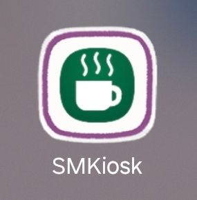

# kiosk_manage

키오스크 **주문/카테고리/메뉴/정산 관리**를 위한 백엔드 API 서버입니다.

- 📅 프로젝트 진행기간: 2025.11.17 ~ 2026.01.17
- 📱 Front(Android): [GitHub repository](https://github.com/unnokid/kiosk_andriod)
- 📌 Notion 정리: [키오스크 프로젝트](https://www.notion.so/2626ec51d18480779573e8a6abe6b456)
- 📄 API 명세서(Postman): [API 명세 및 테스트](https://www.notion.so/API-Postman-2d86ec51d1848038a6cae484f725647c)
- 🧩 ERD: [ERD](https://www.notion.so/ERD-2e86ec51d18480dcbc05fb540ee11b88)

---

## 1) Tech Stack
- Java 17
- Spring Boot 3.5.3
- Spring Data JPA (Hibernate)
- MySQL (RDS / Local)
- Gradle

---

## 2) Features
### ✅ 관리자 데이터 분리
- 관리자(사용자) 단위로 데이터 분리

### ✅ 카테고리/메뉴 관리
- 카테고리 생성/삭제
- 메뉴 생성/삭제

### ✅ 주문/정산
- 주문 생성
- 일일 정산 요약 조회

### ✅ 기타
- 찬조 등록
